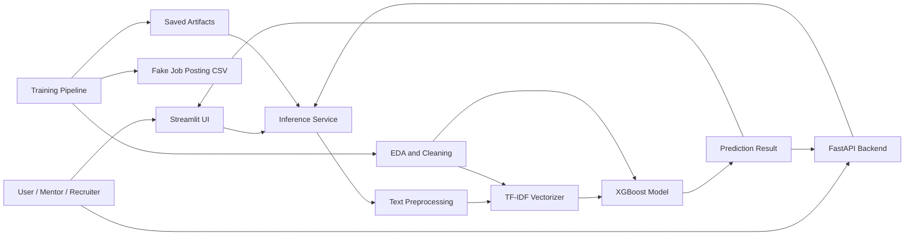
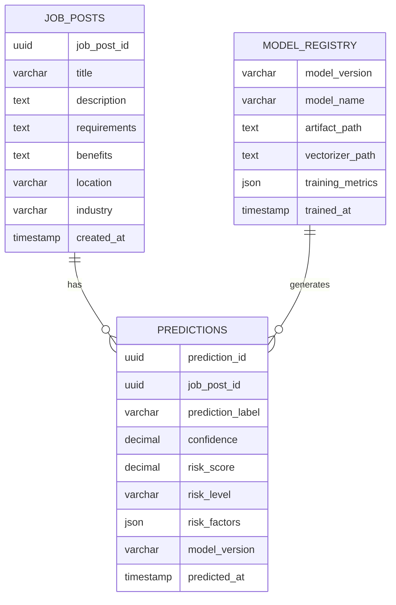
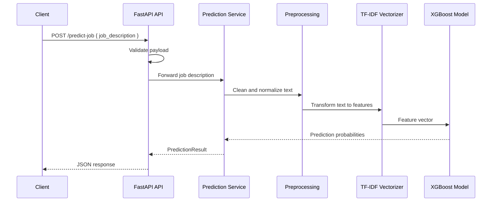
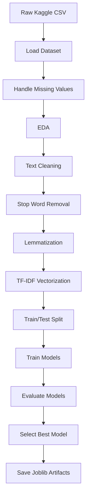
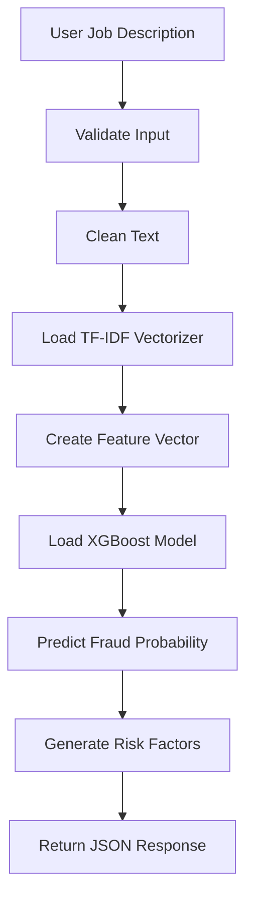
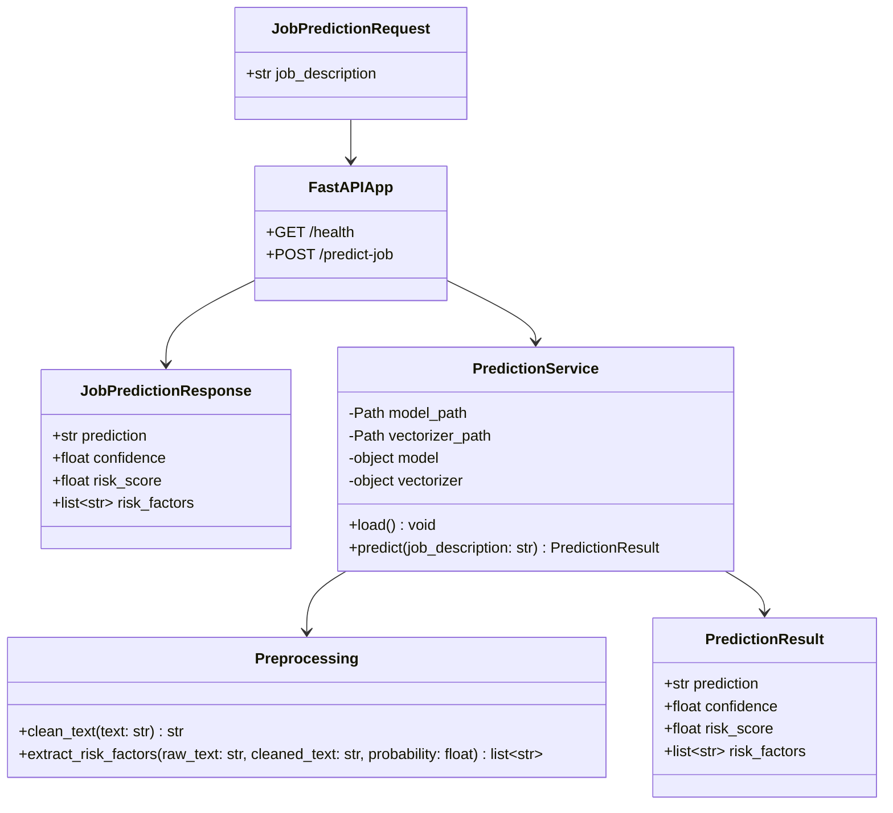
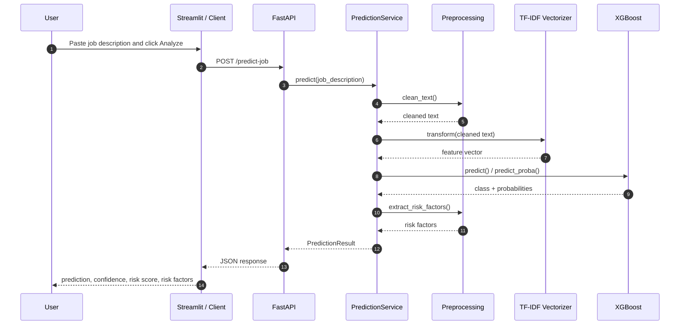
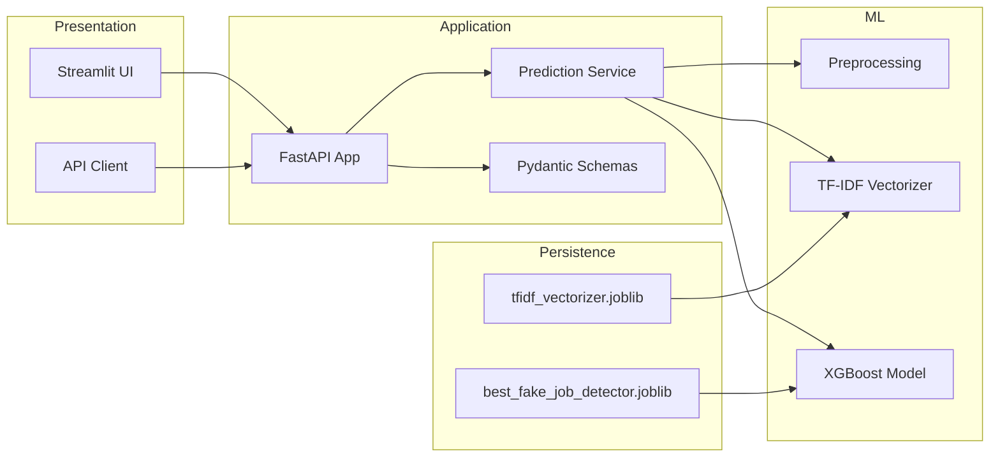

# AI-Powered Job Trust & Career Intelligence Platform

## 1. Executive Summary

The platform analyzes job postings to identify potentially fraudulent listings and support job trust decisions. The first implemented module, **Fake Job Detection**, uses a trained **XGBoost** classifier with **TF-IDF** text features. The system includes:

- A training pipeline that prepares the model from the Kaggle fake job postings dataset.
- A Streamlit application for interactive user analysis.
- A FastAPI backend for programmatic prediction requests.
- Saved model artifacts for repeatable inference.

The design emphasizes reliability, explainability, and a clean separation between training, inference, and presentation layers.

---

## 2. Complete System Architecture

### High-Level Architecture



### Architecture Layers

1. **Presentation Layer**
   - Streamlit frontend for human interaction.
   - FastAPI backend for API consumption.

2. **Application Layer**
   - Prediction service.
   - Risk factor extraction.
   - Error handling and response shaping.

3. **ML Layer**
   - Text preprocessing.
   - TF-IDF vectorization.
   - XGBoost inference.

4. **Data Layer**
   - Kaggle fake job posting dataset for training.
   - Saved joblib artifacts for inference.

5. **Analytics Layer**
   - EDA outputs.
   - Confusion matrix.
   - Model metrics.

---

## 3. Project Folder Structure

```text
AI-Powered Job Trust & Career Intelligence Platform/
|-- fake_job_postings.csv
|-- fake_job_detection.py
|-- streamlit_app.py
|-- architecture_overview.md
|-- artifacts/
|   |-- best_fake_job_detector.joblib
|   |-- tfidf_vectorizer.joblib
|   |-- model_metrics.json
|   |-- confusion_matrix.png
|   `-- eda/
|       |-- target_distribution.png
|       `-- missing_values_top10.png
|-- backend/
|   |-- __init__.py
|   |-- config.py
|   |-- main.py
|   |-- preprocessing.py
|   |-- schemas.py
|   `-- service.py
`-- __pycache__/
```

### Folder Purpose

- `fake_job_detection.py`: trains the model, runs EDA, and saves artifacts.
- `streamlit_app.py`: provides the interactive UI.
- `backend/`: contains the clean FastAPI backend.
- `artifacts/`: stores production inference assets.
- `fake_job_postings.csv`: training dataset.

---

## 4. Database Schema

The current implementation uses a CSV dataset, but for a production-grade platform, a relational schema is recommended.

### Core Tables

#### `job_posts`

| Column | Type | Description |
|---|---|---|
| `job_post_id` | UUID / BIGINT | Unique job posting identifier |
| `title` | VARCHAR(255) | Job title |
| `company_profile` | TEXT | Company summary |
| `description` | TEXT | Full job description |
| `requirements` | TEXT | Candidate requirements |
| `benefits` | TEXT | Benefits text |
| `location` | VARCHAR(255) | Job location |
| `department` | VARCHAR(255) | Department name |
| `employment_type` | VARCHAR(100) | Full-time, part-time, etc. |
| `required_experience` | VARCHAR(100) | Experience requirement |
| `required_education` | VARCHAR(100) | Education requirement |
| `industry` | VARCHAR(255) | Industry category |
| `function` | VARCHAR(255) | Job function |
| `source` | VARCHAR(100) | Source of the posting |
| `created_at` | TIMESTAMP | Ingestion time |

#### `predictions`

| Column | Type | Description |
|---|---|---|
| `prediction_id` | UUID / BIGINT | Unique prediction record |
| `job_post_id` | UUID / BIGINT | Foreign key to `job_posts` |
| `prediction_label` | VARCHAR(50) | Fraudulent or Legitimate |
| `confidence` | DECIMAL(5,4) | Model confidence |
| `risk_score` | DECIMAL(5,2) | Fraud risk score |
| `risk_level` | VARCHAR(20) | High, Medium, Low |
| `risk_factors` | JSON / TEXT | Explainability factors |
| `model_version` | VARCHAR(50) | Trained model version |
| `predicted_at` | TIMESTAMP | Prediction time |

#### `model_registry`

| Column | Type | Description |
|---|---|---|
| `model_version` | VARCHAR(50) | Version tag |
| `model_name` | VARCHAR(100) | XGBoost, Logistic Regression, etc. |
| `artifact_path` | TEXT | Path to serialized model |
| `vectorizer_path` | TEXT | Path to serialized TF-IDF vectorizer |
| `training_metrics` | JSON / TEXT | Accuracy, precision, recall, F1 |
| `trained_at` | TIMESTAMP | Training completion time |

### Relationship View



---

## 5. API Flow

### Endpoint

- `POST /predict-job`

### Input Payload

```json
{
  "job_description": "Paste the job post text here"
}
```

### Output Payload

```json
{
  "prediction": "Fraudulent Job Post",
  "confidence": 0.9088,
  "risk_score": 91.24,
  "risk_factors": [
    "Urgent language detected: immediately",
    "Money language detected: payment",
    "Very short job description, which reduces trust signals"
  ]
}
```

### Flow Description

1. Client submits a job description.
2. FastAPI validates the request with Pydantic.
3. Backend loads the saved XGBoost model and TF-IDF vectorizer.
4. Text is cleaned and transformed into TF-IDF features.
5. The model produces a class label and probability scores.
6. Risk factors are generated using model probability and keyword heuristics.
7. A structured JSON response is returned.

### API Flow Diagram



---

## 6. Data Flow

### Training Data Flow



### Inference Data Flow



---

## 7. UML Diagram

### Class Diagram



### Design Notes

- The request/response schema is strict and self-documenting.
- The service layer isolates machine-learning logic from the API layer.
- Preprocessing is reusable across Streamlit and FastAPI.

---

## 8. Sequence Diagram

### Single Prediction Request



---

## 9. Component Diagram



---

## 10. Technology Justification

### FastAPI

- High-performance Python API framework.
- Automatic OpenAPI documentation.
- Strong integration with Pydantic.
- Clean fit for ML inference endpoints.

### Streamlit

- Fastest path to a polished demo interface.
- Ideal for mentor presentations and stakeholder reviews.
- Minimal boilerplate for data-driven UIs.

### XGBoost

- Strong tabular and sparse-feature performance.
- Handles non-linear feature interactions well.
- Robust baseline for text classification after TF-IDF.
- Usually outperforms simple linear models on noisy structured classification tasks.

### TF-IDF

- Converts text into numeric features without heavy infrastructure.
- Captures term importance across documents.
- Works efficiently with sparse linear and tree-based models.
- Easy to explain and replicate.

### NLTK

- Provides stop words and lemmatization utilities.
- Supports deterministic preprocessing.

### joblib

- Reliable serialization for scikit-learn-compatible artifacts.
- Compact and practical for model deployment.

---

## 11. Why XGBoost Was Chosen

XGBoost was selected as the final model because it delivered the strongest overall balance of metrics during evaluation. In the current training run, it achieved the best F1 score among the compared models, which is especially important for fraud detection where class imbalance exists and recall matters.

### Advantages

- Handles sparse TF-IDF features effectively.
- Learns non-linear patterns that Logistic Regression may miss.
- More expressive than Random Forest on many classification problems.
- Provides strong accuracy with good recall and precision balance.
- Production-friendly and widely trusted in industry.

### Practical Reason

Fake job postings often contain subtle combinations of phrases, urgency cues, and structural patterns. XGBoost is better suited than a simple linear model to capture these interactions in a compact model.

---

## 12. Why TF-IDF Was Used

TF-IDF was chosen because it is a strong, interpretable baseline for textual fraud detection.

### Benefits

- Captures how important a word is within a document relative to the corpus.
- Produces sparse, efficient feature vectors.
- Works well with classical ML algorithms.
- Simple to explain to a university mentor or reviewer.
- Does not require large GPU resources or deep learning infrastructure.

### Why It Fits This Problem

Fake job detection often depends on recurring suspicious wording such as "urgent," "wire transfer," or "bank details." TF-IDF highlights terms that are distinctive across postings, which helps the classifier learn these patterns more effectively.

---

## 13. Error Handling Strategy

- Missing model/vectorizer files return a service-unavailable response.
- Invalid input is rejected by Pydantic validation.
- Unexpected failures are converted into safe 500-level API errors.
- The backend can be extended with structured logging and monitoring.

---

## 14. Future Roadmap

### Short-Term Enhancements

1. Add batch prediction support for multiple job postings.
2. Store inference logs in a database.
3. Add authentication for API access.
4. Add more explainability with SHAP or feature attribution.

### Medium-Term Enhancements

1. Retrain with more recent job-posting data.
2. Evaluate transformer-based text embeddings.
3. Add company reputation and behavioral signals.
4. Add review workflows for human moderation.

### Long-Term Vision

1. Expand into a full career intelligence platform.
2. Add salary intelligence and market demand forecasting.
3. Add resume-job matching and candidate fit scoring.
4. Build multilingual and region-aware fraud detection.
5. Introduce model monitoring, drift detection, and periodic retraining.

---

## 15. Presentation Summary

This platform is designed to demonstrate a realistic end-to-end AI product lifecycle:

- data ingestion
- preprocessing
- model training
- evaluation
- inference backend
- user-facing application
- explainable decision support

It is well suited for a university mentor presentation because it shows both engineering discipline and practical machine learning value.

---

## 16. Suggested Demo Script

1. Open the Streamlit app.
2. Paste a suspicious job description.
3. Show the prediction, confidence, risk score, and risk factors.
4. Explain that the backend uses the saved XGBoost model and TF-IDF vectorizer.
5. Show the API endpoint documentation in FastAPI.
6. Walk through the architecture and future roadmap.

---

## 17. Conclusion

The Fake Job Detection module is a complete AI solution with a clean ML pipeline, a production-style API, and a professional UI. The use of TF-IDF and XGBoost provides a strong balance of interpretability, performance, and implementation simplicity, making it a solid foundation for the broader Job Trust & Career Intelligence Platform.