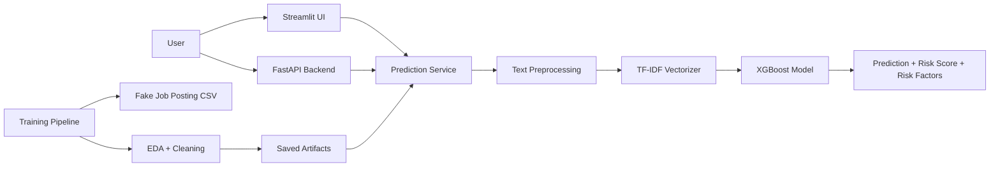

# Mentor Presentation: AI-Powered Job Trust & Career Intelligence Platform

## Slide 1: Title Slide

**Title:** AI-Powered Job Trust & Career Intelligence Platform

**Subtitle:** Fake Job Detection Module

**Presented by:** [Your Name]

**For:** University Project Review

**Key message:**
This project detects potentially fraudulent job postings using machine learning, text processing, and a modern AI-assisted web interface.

---

## Slide 2: Problem Statement

**Problem:**
Online job seekers are increasingly exposed to fake job postings that mislead candidates, collect personal data, or scam users financially.

**Why it matters:**
- Fake job posts reduce trust in recruitment platforms.
- Candidates may lose money, time, or private information.
- Manual verification is slow and not scalable.

**Goal:**
Build an intelligent system that can automatically analyze a job description and flag suspicious postings with an explainable risk score.

---

## Slide 3: Existing Solutions

**Current approaches in the market:**
- Manual moderation by job portals.
- User reporting and complaint-based review.
- Basic keyword filters.
- Rule-based scam detection systems.

**Observed practice:**
Most existing solutions depend heavily on manual review or simple rules rather than adaptive machine learning.

---

## Slide 4: Limitations of Existing Solutions

**Limitations:**
- Manual review is slow and expensive.
- Keyword-based filters miss nuanced scam patterns.
- Rule-based systems create many false positives.
- Existing checks are often not explainable to users.
- Most systems do not provide a clear confidence or risk score.

**Conclusion:**
A smarter AI-based classification system is needed to improve speed, scalability, and trust.

---

## Slide 5: Proposed Solution

**Solution overview:**
The platform uses a trained **XGBoost classifier** with **TF-IDF** text features to predict whether a job posting is legitimate or fraudulent.

**What the system does:**
- Accepts a job description as input.
- Cleans and preprocesses the text.
- Converts the text into numeric features.
- Predicts the job post label.
- Returns prediction, confidence, risk score, and risk factors.

**Delivered modules:**
- Model training pipeline
- Streamlit UI
- FastAPI backend
- Saved model artifacts

---

## Slide 6: Features Completed

**Completed features:**
- Dataset loading from Kaggle fake job postings dataset.
- Exploratory Data Analysis.
- Missing value handling.
- Text cleaning and normalization.
- Stop-word removal.
- Lemmatization.
- TF-IDF vectorization.
- Train/test split.
- Model training and comparison.
- Confusion matrix generation.
- Best model selection.
- Model and vectorizer saving with joblib.
- Streamlit frontend.
- FastAPI backend.

---

## Slide 7: Architecture Diagram

**Explanation:**
The training pipeline creates model artifacts once, and the UI/backend consume those saved artifacts for inference.

---

## Slide 8: Dataset Information

**Dataset used:**
Kaggle Fake Job Postings dataset

**Dataset size:**
- 17,880 records
- 18 columns

**Target column:**
- `fraudulent`

**Useful text fields:**
- `title`
- `company_profile`
- `description`
- `requirements`
- `benefits`

**Class imbalance insight:**
- Legitimate posts: 17,014
- Fraudulent posts: 866

**Implication:**
The dataset is imbalanced, so recall and F1 score are important evaluation metrics.

---

## Slide 9: Data Cleaning Process

**Steps performed:**
1. Loaded the CSV dataset.
2. Replaced missing text values with empty strings.
3. Combined important text columns into one corpus.
4. Lowercased text.
5. Removed URLs, HTML tags, punctuation, and numbers.
6. Removed stop words.
7. Lemmatized tokens.

**Why this matters:**
These steps reduce noise and ensure the model learns from meaningful language patterns rather than formatting artifacts.

---

## Slide 10: Model Comparison

**Evaluation metrics used:**
- Accuracy
- Precision
- Recall
- F1 Score

| Model | Accuracy | Precision | Recall | F1 Score |
|---|---:|---:|---:|---:|
| Logistic Regression | 0.9701 | 0.6375 | 0.8844 | 0.7409 |
| Random Forest | 0.9799 | 1.0000 | 0.5838 | 0.7372 |
| XGBoost | 0.9824 | 0.9825 | 0.6474 | 0.7805 |

**Interpretation:**
XGBoost achieved the best overall balance of performance, especially in F1 score.

---

## Slide 11: Final Model

**Selected model:** XGBoost

**Why it was chosen:**
- Highest F1 score among the tested models.
- Strong accuracy with balanced precision and recall.
- Handles sparse TF-IDF features well.
- Captures non-linear relationships in text signals.

**Saved artifacts:**
- `best_fake_job_detector.joblib`
- `tfidf_vectorizer.joblib`

**Final inference output:**
- Prediction
- Confidence
- Risk Score
- Risk Factors

---

## Slide 12: Demo Workflow

**Live demo steps:**
1. Open the Streamlit application.
2. Paste a sample job description.
3. Click **Analyze**.
4. Show the prediction result.
5. Show confidence score and risk score.
6. Explain the risk factors highlighted by the system.
7. Mention that the same saved model is also exposed through FastAPI.

**Backend demo option:**
- Send a POST request to `/predict-job`.
- Show the JSON response in Swagger UI or via API client.

---

## Slide 13: Future Work

**Short-term enhancements:**
- Batch prediction API.
- Database storage for prediction history.
- Better explanation with SHAP.
- Logging and audit trail.

**Medium-term enhancements:**
- Retrain on newer scam and job data.
- Add multilingual support.
- Add company reputation signals.
- Add candidate safety alerts.

**Long-term roadmap:**
- Resume-job matching.
- Salary intelligence.
- Career recommendations.
- Full trust score for job platforms.

---

## Slide 14: Timeline

**Phase 1: Requirement analysis**
- Defined problem scope and target outcome.

**Phase 2: Dataset understanding**
- Studied the Kaggle fake job dataset and class distribution.

**Phase 3: Data preprocessing**
- Cleaned text, handled missing values, and prepared features.

**Phase 4: Model building**
- Trained Logistic Regression, Random Forest, and XGBoost.

**Phase 5: Evaluation**
- Compared models using accuracy, precision, recall, and F1.

**Phase 6: Deployment layer**
- Built Streamlit UI and FastAPI backend.

**Phase 7: Presentation readiness**
- Generated architecture, review slides, and demo materials.

---

## Slide 15: Challenges

**Major challenges faced:**
- Highly imbalanced dataset.
- Noisy and lengthy job descriptions.
- Multiple missing text fields.
- Need for explainable predictions.
- Keeping preprocessing identical between training and inference.

**How they were addressed:**
- Used F1 score to judge model quality.
- Cleaned and normalized text aggressively.
- Saved the vectorizer and model artifacts.
- Added risk factors for interpretability.
- Reused the same preprocessing logic in both backend and UI.

---

## Slide 16: Conclusion

**Closing summary:**
The Fake Job Detection module demonstrates a practical AI solution for improving trust in job platforms. It combines data cleaning, NLP preprocessing, machine learning, explainability, and modern application delivery.

**Takeaway:**
This project is not only a classifier, but a complete AI product foundation for a broader Job Trust & Career Intelligence Platform.

**Final line for mentor review:**
The system is ready for extension into a full-scale platform with prediction history, reputation scoring, and richer career analytics.